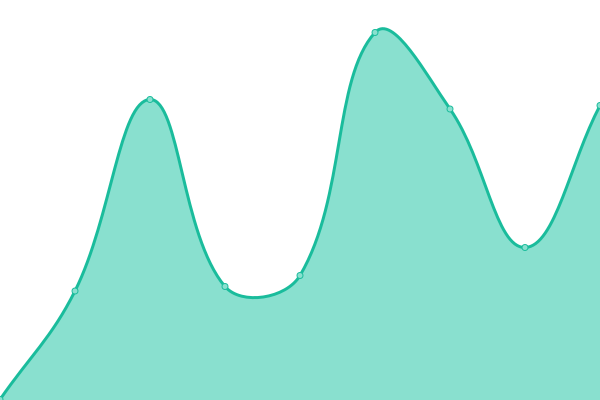
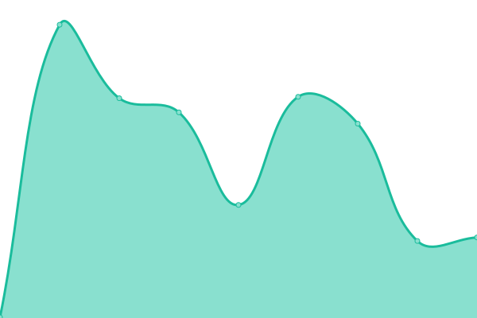

# [📈 Live Status](https://ihatenodejs.github.io/monitor): <!--live status--> **🟧 Partial outage**

This repository contains the open-source uptime monitor and status page for [Aidan](https://aidxn.fun), powered by [Upptime](https://github.com/upptime/upptime).

With [Upptime](https://upptime.js.org), you can get your own unlimited and free uptime monitor and status page, powered entirely by a GitHub repository. We use [Issues](https://github.com/ihatenodejs/monitor/issues) as incident reports, [Actions](https://github.com/ihatenodejs/monitor/actions) as uptime monitors, and [Pages](https://ihatenodejs.github.io/monitor) for the status page.

<!--start: status pages-->
<!-- This summary is generated by Upptime (https://github.com/upptime/upptime) -->
<!-- Do not edit this manually, your changes will be overwritten -->
<!-- prettier-ignore -->
| URL | Status | History | Response Time | Uptime |
| --- | ------ | ------- | ------------- | ------ |
|  [Mail Server](https://user.p0ntus.com) | 🟩 Up | [mail-server.yml](https://github.com/ihatenodejs/monitor/commits/HEAD/history/mail-server.yml) | 

 406ms
     
 | 

<a href="https://status.p0ntus.com/history/mail-server">100.00%</a>
    

|  [Mail Server Dashboard](https://pontusmail.org) | 🟥 Down | [mail-server-dashboard.yml](https://github.com/ihatenodejs/monitor/commits/HEAD/history/mail-server-dashboard.yml) | 

 400ms
     
 | 

<a href="https://status.p0ntus.com/history/mail-server-dashboard">94.16%</a>
    

|  [Vaultwarden](https://vaultwarden.p0ntus.com) | 🟩 Up | [vaultwarden.yml](https://github.com/ihatenodejs/monitor/commits/HEAD/history/vaultwarden.yml) | 

 271ms
     
 | 

<a href="https://status.p0ntus.com/history/vaultwarden">100.00%</a>
    

|  [Archive Website](https://p0ntus.com) | 🟩 Up | [archive-website.yml](https://github.com/ihatenodejs/monitor/commits/HEAD/history/archive-website.yml) | 

 255ms
     
 | 

<a href="https://status.p0ntus.com/history/archive-website">100.00%</a>
    

|  [Main Website](https://aidxn.fun) | 🟩 Up | [main-website.yml](https://github.com/ihatenodejs/monitor/commits/HEAD/history/main-website.yml) | 

 567ms
     
 | 

<a href="https://status.p0ntus.com/history/main-website">100.00%</a>
    

|  [Retro Main Website](https://old.aidxn.fun) | 🟩 Up | [retro-main-website.yml](https://github.com/ihatenodejs/monitor/commits/HEAD/history/retro-main-website.yml) | 

 459ms
     
 | 

<a href="https://status.p0ntus.com/history/retro-main-website">100.00%</a>
    

|  [modules](https://modules.lol) | 🟩 Up | [modules.yml](https://github.com/ihatenodejs/monitor/commits/HEAD/history/modules.yml) | 

 321ms
     
 | 

<a href="https://status.p0ntus.com/history/modules">100.00%</a>
    

<!--end: status pages-->

[**Visit our status website →**](https://ihatenodejs.github.io/monitor)

## 📄 License

- Powered by: [Upptime](https://github.com/upptime/upptime)
- Code: [MIT](./LICENSE) © [Anand Chowdhary](https://anandchowdhary.com), supported by [Pabio](https://pabio.com)
- Data in the `./history` directory: [Open Database License](https://opendatacommons.org/licenses/odbl/1-0/)
