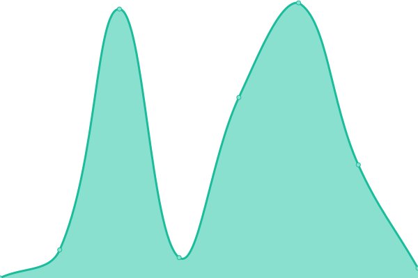
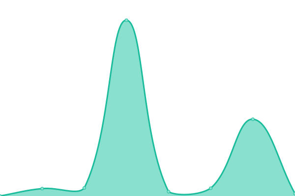
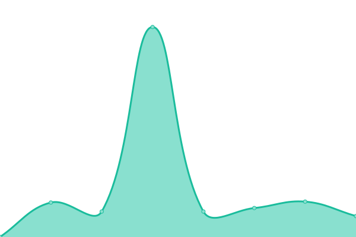
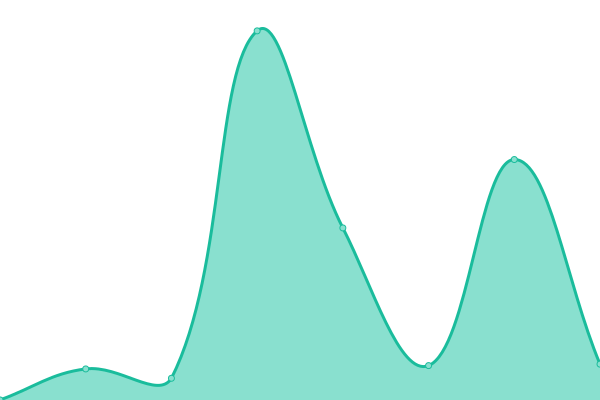

# [📈 Live Status](https://ihatenodejs.github.io/monitor): <!--live status--> **🟧 Partial outage**

This repository contains the open-source uptime monitor and status page for [Aidan](https://aidxn.fun), powered by [Upptime](https://github.com/upptime/upptime).

With [Upptime](https://upptime.js.org), you can get your own unlimited and free uptime monitor and status page, powered entirely by a GitHub repository. We use [Issues](https://github.com/ihatenodejs/monitor/issues) as incident reports, [Actions](https://github.com/ihatenodejs/monitor/actions) as uptime monitors, and [Pages](https://ihatenodejs.github.io/monitor) for the status page.

<!--start: status pages-->
<!-- This summary is generated by Upptime (https://github.com/upptime/upptime) -->
<!-- Do not edit this manually, your changes will be overwritten -->
<!-- prettier-ignore -->
| URL | Status | History | Response Time | Uptime |
| --- | ------ | ------- | ------------- | ------ |
|  [Main Website](https://www.aidxn.cc) | 🟩 Up | [main-website.yml](https://github.com/ihatenodejs/monitor/commits/HEAD/history/main-website.yml) | 

 177ms
     
 | 

<a href="https://status.p0ntus.com/history/main-website">100.00%</a>
    

|  [LibreCloud](https://librecloud.cc) | 🟥 Down | [libre-cloud.yml](https://github.com/ihatenodejs/monitor/commits/HEAD/history/libre-cloud.yml) | 

 408ms
     
 | 

<a href="https://status.p0ntus.com/history/libre-cloud">99.96%</a>
    

|  [LibreCloud Webmail](https://mail.librecloud.cc) | 🟥 Down | [libre-cloud-webmail.yml](https://github.com/ihatenodejs/monitor/commits/HEAD/history/libre-cloud-webmail.yml) | 

 287ms
     
 | 

<a href="https://status.p0ntus.com/history/libre-cloud-webmail">99.96%</a>
    

|  [LibreCloud Pass (Vaultwarden)](https://vaultwarden.p0ntus.com) | 🟩 Up | [libre-cloud-pass-vaultwarden.yml](https://github.com/ihatenodejs/monitor/commits/HEAD/history/libre-cloud-pass-vaultwarden.yml) | 

 363ms
     
 | 

<a href="https://status.p0ntus.com/history/libre-cloud-pass-vaultwarden">100.00%</a>
    

|  [LibreCloud Authentik](https://auth.librecloud.cc) | 🟥 Down | [libre-cloud-authentik.yml](https://github.com/ihatenodejs/monitor/commits/HEAD/history/libre-cloud-authentik.yml) | 

 528ms
     
 | 

<a href="https://status.p0ntus.com/history/libre-cloud-authentik">99.97%</a>
    

|  [LibreCloud Gitea](https://git.pontusmail.org) | 🟥 Down | [libre-cloud-gitea.yml](https://github.com/ihatenodejs/monitor/commits/HEAD/history/libre-cloud-gitea.yml) | 

 441ms
     
 | 

<a href="https://status.p0ntus.com/history/libre-cloud-gitea">99.97%</a>
    

|  [Alt Main Website](https://aidxn.fun) | 🟩 Up | [alt-main-website.yml](https://github.com/ihatenodejs/monitor/commits/HEAD/history/alt-main-website.yml) | 

 568ms
     
 | 

<a href="https://status.p0ntus.com/history/alt-main-website">99.79%</a>
    

|  [aidxnFUNretro](https://old.aidxn.fun) | 🟥 Down | [aidxn-fu-nretro.yml](https://github.com/ihatenodejs/monitor/commits/HEAD/history/aidxn-fu-nretro.yml) | 

 318ms
     
 | 

<a href="https://status.p0ntus.com/history/aidxn-fu-nretro">99.98%</a>
    

|  [Disfunction Blog](https://disfunction.blog) | 🟥 Down | [disfunction-blog.yml](https://github.com/ihatenodejs/monitor/commits/HEAD/history/disfunction-blog.yml) | 

 546ms
     
 | 

<a href="https://status.p0ntus.com/history/disfunction-blog">99.98%</a>
    

|  [Archive Website](https://p0ntus.com) | 🟥 Down | [archive-website.yml](https://github.com/ihatenodejs/monitor/commits/HEAD/history/archive-website.yml) | 

 317ms
     
 | 

<a href="https://status.p0ntus.com/history/archive-website">99.99%</a>
    

|  [Retro Main Website](https://old.aidxn.fun) | 🟥 Down | [retro-main-website.yml](https://github.com/ihatenodejs/monitor/commits/HEAD/history/retro-main-website.yml) | 

 67ms
     
 | 

<a href="https://status.p0ntus.com/history/retro-main-website">99.99%</a>
    

|  [modules](https://modules.lol) | 🟥 Down | [modules.yml](https://github.com/ihatenodejs/monitor/commits/HEAD/history/modules.yml) | 

 351ms
     
 | 

<a href="https://status.p0ntus.com/history/modules">100.00%</a>
    

<!--end: status pages-->

[**Visit our status website →**](https://ihatenodejs.github.io/monitor)

## 📄 License

- Powered by: [Upptime](https://github.com/upptime/upptime)
- Code: [MIT](./LICENSE) © [Anand Chowdhary](https://anandchowdhary.com), supported by [Pabio](https://pabio.com)
- Data in the `./history` directory: [Open Database License](https://opendatacommons.org/licenses/odbl/1-0/)
